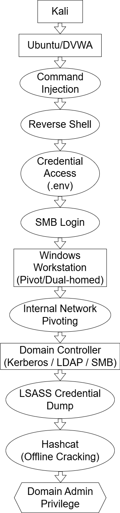
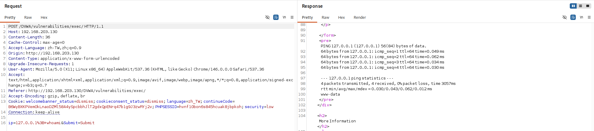
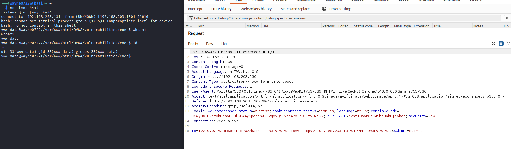
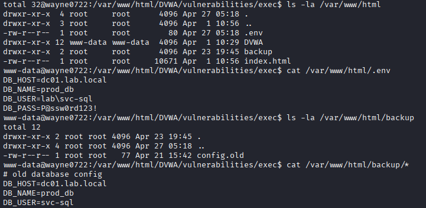
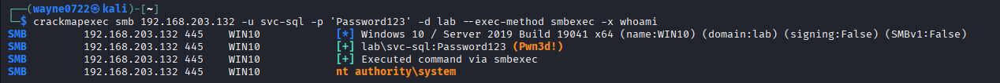
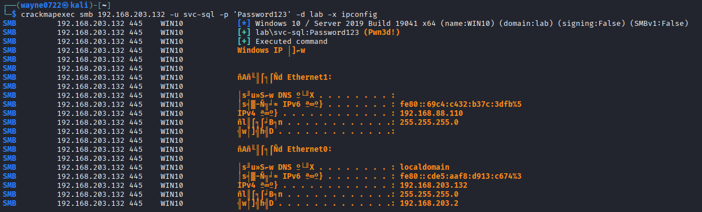
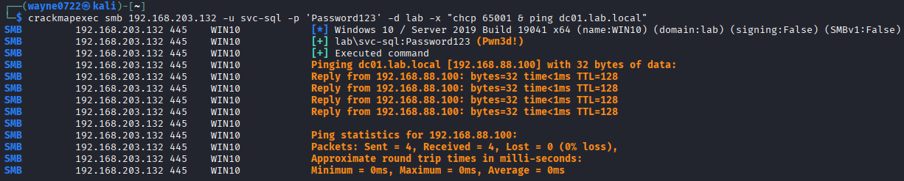
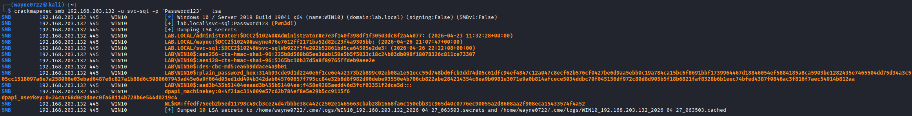
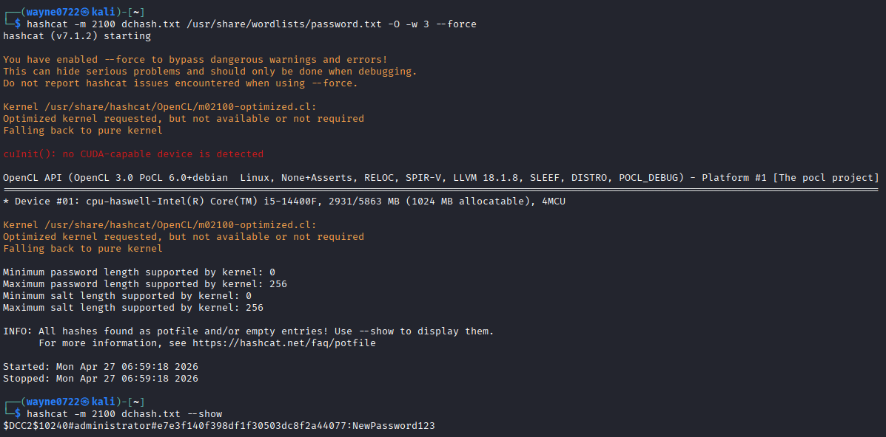
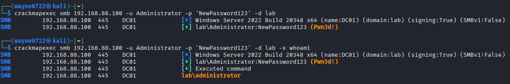

# Web to Active Directory Penetration Test Report

## Document Information

| Item | Details |
| --- | --- |
| Project | Web to Active Directory Compromise Lab |
| Assessment Type | Web application and internal network penetration testing simulation |
| Environment | Isolated lab environment |
| Primary Objective | Assess whether a web vulnerability can be chained into Active Directory compromise |
| Language | English |

> This report is prepared for portfolio purposes. All testing was conducted in a self-owned, isolated, and authorized lab environment. Accounts, passwords, and IP addresses referenced in this report belong only to the lab.

## Executive Summary

This assessment simulates an external attacker targeting a DVWA web application hosted on an Ubuntu server and evaluates whether a single web application vulnerability can lead to broader impact against an internal Active Directory environment.

The assessment found that an attacker can exploit Command Injection in the web application to obtain initial shell access to the Ubuntu web server. After gaining shell access, the attacker discovers an exposed `.env` configuration file containing a reusable domain service account credential. Due to credential reuse and excessive privileges, the same account can authenticate to a Windows workstation over SMB.

The compromised Windows workstation is dual-homed, connecting both the external and internal network segments. This creates a bridge into the internal network and allows the attacker to reach the Domain Controller. The attack chain proceeds through credential extraction from LSASS, offline hash cracking, and validation of Domain Admin access.

The overall risk is Critical. The compromise is not caused by a single issue alone, but by multiple control failures chained together: insufficient input validation, exposed configuration secrets, credential reuse, excessive service account privileges, weak network segmentation, and limited detection of lateral movement and credential access.

## Risk Rating

| Risk Item | Severity | Impact |
| --- | --- | --- |
| Command Injection leading to remote command execution | Critical | Web server shell access |
| Exposed `.env` configuration file | High | Reusable service account credential exposure |
| Service account credential reuse and excessive privileges | Critical | Lateral movement to Windows workstation |
| Dual-homed host weakening network segmentation | High | External-to-internal pivot path |
| LSASS credential extraction and weak password | Critical | Domain Admin compromise |

Overall risk rating: **Critical**

Rationale: An attacker can start from an externally reachable web service, expand access through credential reuse and network pivoting, and ultimately obtain Active Directory Domain Admin privileges.

## Scope

| Role | System | IP Address | Description |
| --- | --- | --- | --- |
| Attacker | Kali Linux | 192.168.203.131 | Attacker machine |
| Web Server | Ubuntu / DVWA | 192.168.203.130 | Initial target |
| Pivot Host | Windows 10 Pro | 192.168.203.132 / 192.168.88.110 | Dual-homed workstation |
| Domain Controller | Windows Server 2022 | 192.168.88.100 | Active Directory Domain Controller |

Network segments:

- External network: 192.168.203.0/24
- Internal network: 192.168.88.0/24

## Methodology

The assessment followed a common penetration testing flow:

1. Asset and service identification
2. Web vulnerability validation
3. Initial access
4. Sensitive information discovery
5. Credential validation
6. Lateral movement
7. Internal network path confirmation
8. Active Directory enumeration
9. Credential access and privilege escalation
10. Impact assessment and remediation planning

All major conclusions in this report are supported by screenshots and testing artifacts stored under `evidence/core` or `evidence/raw`.

## Tools and Techniques

| Category | Tool / Technique | Purpose |
| --- | --- | --- |
| Web testing | Browser, manual payload validation | Validate Command Injection and response behavior |
| Initial access | Reverse shell | Obtain shell access on the web server |
| Service discovery | nmap | Identify external and internal services |
| Windows / AD testing | crackmapexec | SMB authentication, remote command execution, credential extraction |
| AD tooling | impacket | Active Directory validation and enumeration |
| Credential testing | hashcat | Offline NTLM hash cracking |
| System enumeration | ipconfig, arp, nslookup | Confirm interfaces, routes, and DC reachability |

## Severity Definition

| Severity | Definition |
| --- | --- |
| Critical | Can lead to full system control, Domain Admin compromise, large-scale data exposure, or critical service disruption |
| High | Can cause unauthorized access, lateral movement, sensitive information exposure, or compromise of important assets |
| Medium | Requires additional conditions to expand impact but still presents meaningful risk |
| Low | Limited direct impact, usually informational exposure, hardening gap, or configuration weakness |

## Attack Path Overview

<p align="center">
  
</p>

Attack path:

```text
External Attacker
-> Web Command Injection
-> Reverse Shell on Ubuntu
-> Exposed .env Credential
-> SMB Authentication to Windows Workstation
-> Pivot via Dual-homed Host
-> Domain Controller Access
-> LSASS Credential Extraction
-> Hash Cracking
-> Domain Admin Compromise
```

## Findings

## Finding 1: Command Injection Leading to Remote Command Execution

| Field | Details |
| --- | --- |
| Severity | Critical |
| Affected Asset | Ubuntu / DVWA, 192.168.203.130 |
| Weakness Type | OS Command Injection |
| Impact | Arbitrary system command execution on the web server |

### Description

The command execution functionality in DVWA does not properly restrict user-controlled input. An attacker can inject command separators and append additional operating system commands to be executed by the backend. This allows the attacker to move from web application access to operating system command execution and then establish shell access.

### Evidence

Command Injection request / response:

<p align="center">
  
</p>

Reverse shell:

<p align="center">
  
</p>

### Impact

Successful exploitation allows an attacker to:

- Execute system commands
- Read local files from the web server
- Enumerate the web root and configuration files
- Establish a reverse shell
- Use the web server as the initial foothold for internal attacks

### Root Cause

- Lack of strict allowlist validation for user input
- Direct passing of user input into system commands
- Absence of safer parameterized command execution patterns

### Recommendation

- Avoid invoking a shell with user-controlled input
- Use safe APIs and fixed parameters when system commands are unavoidable
- Apply allowlist validation, such as accepting only valid IP or hostname formats
- Run the web service under a least-privilege account
- Monitor suspicious command execution through WAF, EDR, and system audit logs

## Finding 2: Exposed Web Server Configuration File and Valid Credentials

| Field | Details |
| --- | --- |
| Severity | High |
| Affected Asset | Ubuntu / DVWA, 192.168.203.130 |
| Weakness Type | Sensitive Information Disclosure |
| Impact | Service account credentials can be obtained and reused for lateral movement |

### Description

After obtaining shell access on the web server, the attacker discovers a `.env` configuration file and backup files in the web directory. These files contain credentials for a service account that can be used to authenticate against Windows / AD systems.

This turns the web server compromise into an identity and lateral movement risk. If the same credentials are valid on other systems, an attacker can expand beyond the original web server.

### Evidence

<p align="center">
  
</p>

Observed sensitive information:

- Domain service account: `lab\svc-sql`
- Password: redacted in report text; full value is retained only in lab evidence screenshots
- Backup files also contained references to the same account

### Impact

With valid credentials, an attacker can:

- Attempt authentication to other Windows hosts
- Test SMB, RDP, WinRM, and related services
- Perform credential reuse attacks
- Bypass some perimeter controls by using a valid account

### Root Cause

- Sensitive configuration files stored in a location readable from the web server context
- Inadequate permissions on configuration and backup files
- Credentials not isolated by service or usage scope

### Recommendation

- Remove `.env`, backup files, and any password-containing files from the web directory
- Use a secrets manager or secure environment-level configuration management
- Restrict the web service account's access to configuration files
- Immediately rotate exposed credentials
- Review all login history and privilege assignments for the exposed account

## Finding 3: Service Account Credential Reuse and Excessive Privileges

| Field | Details |
| --- | --- |
| Severity | Critical |
| Affected Asset | Windows 10 Workstation, 192.168.203.132 |
| Weakness Type | Credential Reuse / Excessive Privilege |
| Impact | Attacker can move laterally from the web server to a Windows workstation |

### Description

The attacker uses credentials discovered on the web server to authenticate to the external Windows workstation over SMB. The test confirms that the account can successfully authenticate and has sufficient privileges to perform remote operations.

This indicates that the service account is not limited to application or database usage. It is also able to access Windows hosts with elevated privileges, allowing one leaked credential to become a broader internal compromise path.

### Evidence

<p align="center">
  
</p>

### Impact

The attacker can:

- Authenticate to the Windows workstation with a valid account
- Execute remote commands
- Read system and network configuration
- Establish a new internal attack position
- Continue toward the internal network and Domain Controller

### Root Cause

- Service account password reused across multiple systems
- Service account allowed interactive or remote administrative access
- Least privilege not enforced
- No host-level restriction for where the service account may log in

### Recommendation

- Use dedicated accounts and unique passwords per service
- Deny interactive logon for service accounts
- Restrict where service accounts can authenticate
- Remove unnecessary local administrator and remote management privileges
- Implement password rotation and monitoring for high-risk service accounts

## Finding 4: Dual-homed Host Weakening Network Segmentation

| Field | Details |
| --- | --- |
| Severity | High |
| Affected Asset | Windows 10 Workstation, 192.168.203.132 / 192.168.88.110 |
| Weakness Type | Network Segmentation Weakness |
| Impact | Attacker can pivot from the external segment into the internal network |

### Description

The Windows workstation has two network interfaces and is connected to both the external and internal segments. Once the attacker gains access to this host, it can be used to confirm internal routing and reachability to the Domain Controller.

This design allows internal assets that should be protected by segmentation to become indirectly exposed through a compromised external-facing path. Even though the web server does not directly connect to the internal network, the dual-homed workstation provides a pivot point.

### Evidence

Workstation network configuration:

<p align="center">
  
</p>

Connectivity to the Domain Controller:

<p align="center">
  
</p>

### Impact

The attacker can:

- Cross from the external segment into the internal segment
- Probe internal services
- Reach the Domain Controller
- Bypass the intended perimeter isolation model

### Root Cause

- Workstation connected to multiple security zones
- Lack of strict access control for cross-zone hosts
- Network segmentation exists topologically but is not enforced through traffic control

### Recommendation

- Avoid connecting general-purpose workstations to multiple security zones
- Apply strict firewall policies to any required cross-zone hosts
- Limit reachability from the external segment to the internal network
- Monitor cross-zone SMB, RDP, LDAP, Kerberos, and related traffic
- Periodically review dual-NIC and unexpected route configurations

## Finding 5: LSASS Credential Extraction and Weak Password Leading to Domain Admin Compromise

| Field | Details |
| --- | --- |
| Severity | Critical |
| Affected Asset | Windows Workstation / Domain Controller |
| Weakness Type | Credential Dumping / Weak Password |
| Impact | Attacker obtains Domain Admin privileges |

### Description

After gaining control of the Windows workstation, the attacker extracts credential material from LSASS and obtains multiple NTLM hashes. Offline cracking then reveals a high-privilege account password, which is validated against the Domain Controller.

This result means the attacker has expanded from a single web vulnerability to full Active Directory compromise. In a real environment, the attacker could create domain accounts, deploy malicious tooling, steal data, modify Group Policy, or disrupt critical services.

### Evidence

LSASS credential dump:

<p align="center">
  
</p>

Hash cracking:

<p align="center">
  
</p>

Domain Controller validation:

<p align="center">
  
</p>

### Impact

With Domain Admin privileges, an attacker can:

- Control all domain-joined systems
- Create, delete, or modify domain accounts
- Access sensitive data and file shares
- Deploy persistence mechanisms
- Modify Group Policy
- Disable security controls or disrupt service availability

### Root Cause

- High-privilege credential material is available from LSASS on a workstation
- High-privilege account password can be cracked offline
- Credential Guard or equivalent protection is not enabled
- Credential dumping behavior is not detected or blocked by EDR

### Recommendation

- Enable Windows Defender Credential Guard
- Prevent Domain Admin accounts from logging into regular workstations
- Apply an administrative tiering model, such as Tier 0 / Tier 1 / Tier 2
- Use long passwords and MFA for administrative accounts
- Monitor LSASS access, suspicious dump activity, and authentication spikes
- Periodically review high-privilege account logon history

## MITRE ATT&CK Mapping

| Phase | Technique | Description |
| --- | --- | --- |
| Initial Access | Exploit Public-Facing Application | Web Command Injection used for initial access |
| Execution | Command and Scripting Interpreter | System commands and shell execution |
| Credential Access | Unsecured Credentials | Credentials obtained from `.env` |
| Lateral Movement | Remote Services: SMB | SMB used to access the Windows workstation |
| Discovery | System Network Configuration Discovery | `ipconfig` used to identify dual NICs |
| Discovery | Remote System Discovery | Domain Controller reachability confirmed |
| Credential Access | OS Credential Dumping | Credential material extracted from LSASS |
| Credential Access | Brute Force / Password Cracking | NTLM hash cracked offline |
| Privilege Escalation | Valid Accounts | High-privilege account used to validate Domain Admin access |

## Business Impact

If this attack chain occurred in a real enterprise environment, it could result in:

- Confidential data exposure
- Lateral compromise of internal systems
- Unauthorized modification of domain accounts and privileges
- Persistence deployed across endpoints and servers
- Security tooling disabled or bypassed
- Critical service disruption
- Increased incident response and recovery cost

This case demonstrates that a web application vulnerability should not be evaluated only as a single-host risk. When credential management, privilege control, and network segmentation fail together, an externally reachable web service can become the entry point into the Active Directory core.

## Prioritized Remediation Plan

### Immediate Actions

1. Fix Command Injection and prevent user input from reaching system commands.
2. Remove `.env`, backup files, and sensitive files from the web directory.
3. Immediately rotate exposed service account and administrator credentials.
4. Disable or restrict interactive and remote logon rights for service accounts such as `svc-sql`.
5. Review whether Domain Admin accounts have logged into regular workstations.

### Short-term Improvements

1. Redesign service account privileges according to least privilege.
2. Remove unnecessary dual-homed hosts or apply strict firewall policies.
3. Enforce ACLs and traffic monitoring between external and internal segments.
4. Tune EDR detections for LSASS access, remote command execution, and lateral movement.
5. Apply stronger password length requirements and rotation for critical accounts.

### Long-term Improvements

1. Establish an Active Directory administrative tiering model.
2. Introduce a secrets management process.
3. Build a recurring vulnerability assessment and penetration testing process.
4. Implement SIEM correlation for abnormal authentication and cross-zone movement.
5. Develop incident response playbooks for credential exposure and AD compromise scenarios.

## Detection Opportunities

| Attack Stage | Observable Behavior | Suggested Detection |
| --- | --- | --- |
| Command Injection | Command separators, system commands, or abnormal parameters in web requests | WAF logs, web access logs, EDR process telemetry |
| Reverse Shell | Web server establishing unusual outbound connections | Firewall logs, NetFlow, EDR network events |
| Credential Discovery | Web service account reading `.env`, backup files, or unexpected configuration files | Linux auditd, file integrity monitoring |
| SMB Lateral Movement | Same service account authenticating to multiple hosts | Windows Event ID 4624, 4627, 4672 |
| Remote Command Execution | Remote execution behavior through SMB services | Windows Event ID 7045, 4688, Sysmon |
| LSASS Access | Unexpected process access to LSASS memory | EDR alert, Sysmon Event ID 10 |
| Domain Admin Use | Domain Admin account logging into a regular workstation or non-admin host | AD logon events, SIEM correlation rule |

## Retest Criteria

After remediation, retesting should confirm that:

- Web parameters can no longer execute arbitrary system commands.
- The web server no longer contains readable `.env` or backup credential files.
- The exposed service account cannot log in to the Windows workstation.
- Regular workstations cannot bridge external and internal networks, or cross-zone traffic is restricted.
- LSASS access behavior is detected by EDR or Windows event logging.
- Domain Admin accounts do not appear in logon records for regular workstations.

## Conclusion

This assessment demonstrates that a single Web Command Injection vulnerability can be chained into full Active Directory compromise when defense-in-depth controls are missing.

The core issues in the attack chain are:

- Insufficient web application input validation
- Sensitive credential exposure on the web server
- Service account credential reuse
- Excessive service account privileges
- Dual-homed host weakening network segmentation
- Insufficient protection of high-privilege credentials

The defensive response should not stop at patching the web vulnerability. Credential management, privilege control, network segmentation, and detection capability must also be improved. Fixing only Command Injection leaves other paths open; rotating passwords without correcting privilege and network design may allow the next credential exposure to become another lateral movement path.

A defense-in-depth approach is recommended, treating web security, host security, Active Directory security, and network security as connected controls along the same attack path.

## Appendix: Evidence Index

| Evidence | File |
| --- | --- |
| Attack path diagram | `evidence/core/attack-path.png` |
| Command Injection request / response | `evidence/core/command-injection-request-response.png` |
| Reverse shell | `evidence/core/reverse-shell.png` |
| `.env` credential exposure | `evidence/core/exposed-env-file.png` |
| Windows SMB authentication success | `evidence/core/win10-smb-pwned.png` |
| Windows dual-NIC configuration | `evidence/core/win10-ipconfig.png` |
| Windows connectivity to DC | `evidence/core/win10-ping-dc.png` |
| LSASS dump | `evidence/core/lsass-dump.png` |
| Hashcat cracking | `evidence/core/hashcat-cracking.png` |
| Domain Controller validation | `evidence/core/dc-smb-pwned.png` |
